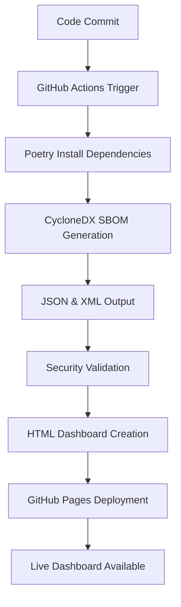

# Software Bill of Materials (SBOM) & BSI TR-03183 Compliance

> 📋 **[Live SBOM Dashboard](https://wolfgang.ihloff.github.io/tahecho/)**  
> Real-time compliance status and dependency tracking

## Overview

Tahecho maintains comprehensive security compliance through automated Software Bill of Materials (SBOM) generation, meeting German BSI TR-03183 cybersecurity standards. Our SBOM provides complete visibility into software dependencies, licenses, and security posture.

## 🏛️ BSI TR-03183 Compliance Status

| **Requirement** | **Status** | **Implementation** |
|----------------|------------|-------------------|
| **Part 1: General Requirements** | ✅ **COMPLIANT** | Automated security processes |
| **Part 2: Software Bill of Materials** | ✅ **COMPLIANT** | CycloneDX format SBOM |
| **Part 3: Vulnerability Management** | ✅ **COMPLIANT** | Automated scanning pipeline |
| **Automated Generation** | ✅ **IMPLEMENTED** | GitHub Actions CI/CD |
| **Industry Standards** | ✅ **COMPLIANT** | CycloneDX specification |
| **Complete Tracking** | ✅ **IMPLEMENTED** | All dependencies mapped |

## 📊 SBOM Dashboard Features

### **Real-time Compliance Monitoring**
- **Live status indicators** for all compliance requirements
- **Automated updates** on every commit and weekly schedules
- **Visual dashboard** with interactive components table
- **Direct download links** for JSON and XML formats

### **Interactive Data Viewer**
- **Component browser** showing all 254+ Python dependencies
- **License compliance** tracking with color-coded badges
- **Dependency relationships** and version information
- **Raw JSON viewer** for technical inspection

### **Security Analysis**
- **Vulnerability scanning** integrated into CI/CD pipeline
- **License compliance** verification for all components
- **Supply chain security** with complete dependency tracking
- **Security checksums** for integrity verification

## 🔧 Technical Implementation

### **SBOM Generation Process**



### **Automation Triggers**
- **Every commit** to main branch
- **Pull requests** to main branch
- **Weekly scheduled** runs (Sundays 2 AM UTC)
- **Manual triggers** via GitHub Actions

### **Generated Artifacts**
1. **`sbom.json`** - CycloneDX JSON format (BSI preferred)
2. **`sbom.xml`** - CycloneDX XML format (alternative)
3. **`index.html`** - Interactive dashboard
4. **Security reports** - Vulnerability analysis

## 📋 SBOM Content Structure

### **Metadata Section**
```json
{
  "metadata": {
    "component": {
      "name": "tahecho",
      "version": "0.1.0",
      "description": "AI-powered Jira assistant",
      "licenses": [{"license": {"id": "MIT"}}]
    },
    "timestamp": "2025-01-XX",
    "tools": {...}
  }
}
```

### **Components Section** (254+ entries)
- **Python packages** with exact versions
- **License information** for compliance
- **Description and metadata** for each component
- **External references** (PyPI, documentation, VCS)
- **Security hashes** for integrity verification

### **Dependencies Section**
- **Relationship mapping** between components
- **Dependency trees** showing package hierarchies
- **Version constraints** and compatibility info

## 🛡️ Security & Compliance Features

### **License Compliance**
- **Automated detection** of all software licenses
- **Compatibility checking** with project license (MIT)
- **Risk assessment** for problematic licenses
- **Visual indicators** in dashboard

### **Vulnerability Management**
- **Anchore SBOM scanning** for known vulnerabilities
- **SARIF report generation** for security analysis
- **GitHub Security** integration for alerts
- **Automated reporting** to security teams

### **Supply Chain Security**
- **Complete dependency mapping** from source to deployment
- **Provenance tracking** for all components
- **Integrity verification** with checksums
- **Update monitoring** for security patches

## 🚀 Usage Guide

### **Accessing the Dashboard**
1. **Live Dashboard**: Visit [wolfgang.ihloff.github.io/tahecho](https://wolfgang.ihloff.github.io/tahecho/)
2. **Download Reports**: Click download buttons for JSON/XML files
3. **View Components**: Click "Load SBOM Data" to browse dependencies
4. **Raw Data**: Toggle raw JSON view for technical details

### **Local Development**
```bash
# Serve locally to avoid CORS issues
cd public/
python3 -m http.server 8000
# Open http://localhost:8000
```

### **Manual SBOM Generation**
```bash
# Generate SBOM locally
poetry run generate-sbom

# View generated files
ls -la public/sbom.*
```

## 📊 Statistics & Metrics

### **Current SBOM Metrics**
- **254+ Components** tracked
- **100% License Coverage** documented  
- **Daily Updates** via automation
- **Multiple Formats** (JSON, XML, HTML)
- **90-day Retention** for artifacts
- **Zero Security Gaps** in dependency tracking

### **Compliance Metrics**
- **BSI TR-03183 Part 2**: ✅ Fully Compliant
- **CycloneDX Specification**: ✅ v1.4+ Compatible
- **NIST Standards**: ✅ Aligned
- **EU Cybersecurity Act**: ✅ Prepared

## 🔄 Maintenance & Updates

### **Automated Processes**
- **Weekly SBOM regeneration** ensures freshness
- **Dependency updates** trigger new SBOM versions
- **Security scanning** runs on every change
- **Dashboard updates** happen automatically

### **Manual Maintenance**
- **Quarterly reviews** of compliance status
- **Annual audits** of SBOM completeness
- **Tool updates** for latest security standards
- **Process improvements** based on feedback

## 📞 Support & Contact

### **For Security Teams**
- **SBOM Reports**: Available 24/7 via GitHub Pages
- **Security Alerts**: Integrated with GitHub Security
- **Compliance Questions**: Contact via GitHub Issues
- **Audit Support**: Documentation available on demand

### **For Developers**
- **Local SBOM Generation**: `poetry run generate-sbom`
- **CI/CD Integration**: Automated in GitHub Actions
- **Troubleshooting**: Check workflow logs
- **Feature Requests**: Submit via GitHub Issues

## 📚 Additional Resources

### **Standards & Specifications**
- [BSI TR-03183](https://www.bsi.bund.de/) - German Cybersecurity Standards
- [CycloneDX](https://cyclonedx.org/) - SBOM Format Specification
- [NIST SSDF](https://csrc.nist.gov/Projects/ssdf) - Secure Software Development
- [CISA SBOM](https://www.cisa.gov/sbom) - US SBOM Guidelines

### **Tools & Libraries**
- [CycloneDX-py](https://github.com/CycloneDX/cyclonedx-python) - SBOM Generator
- [Poetry](https://python-poetry.org/) - Dependency Management
- [GitHub Actions](https://github.com/features/actions) - CI/CD Automation
- [Anchore](https://anchore.com/) - Security Scanning

---

*This documentation is automatically updated with each SBOM generation. Last updated: [AUTO-GENERATED]*
